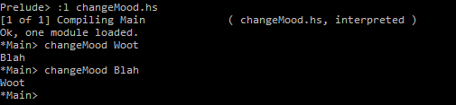

# Chapter 4 Exercises

## Exercise 1: Mood Swing

Given the following datatype, answer the following questions:
```haskell
data Mood = Blah | Woot deriving Show
```
The `deriving Show` part is not something we’ve explained yet. For
now, all we’ll say is that when you make your own datatypes, deriving
Show allows the values of that type to be printed to the screen. We’ll
talk about it more when we talk about typeclasses in detail.

### 1

What is the type constructor, or name of this type?

---

"`Mood`" is the type constructor.

### 2

If the function requires a `Mood` value, what are the values you
could possibly use?

---
`Blah` or `Woot`

### 3

We are trying to write a function `changeMood` to change Chris’s
mood instantaneously. It should act like `not` in that, given one
value, it returns the _other_ value of the same type. So far, we’ve
written a type signature `changeMood :: Mood -> Woot`. What’s wrong
with that?

---
In the type signiture, the _type_ of data being passed too and returned from a function is defined. In `changeMood :: Mood -> Woot`, while we are passing a `Mood` object _too_ the function, we haven't defined a `Woot` object. To correct this use `changeMood :: Mood -> Mood`
### 4

Now we want to write the function that changes his mood. Given
an input mood, it gives us the other one. Fix any mistakes and
complete the function:
```haskell
changeMood Mood = Woot
changeMood _ = Blah
```
We’re doing something here called _pattern matching_. We can
define a function by matching on a data constructor, or value,
and describing the behavior that the function should have based
on which value it matches. The underscore in the second line
denotes a catch-all, otherwise case. So, in the first line of the
function, we’re telling it what to do in the case of a specific input.
In the second one, we’re telling it what to do regardless of _all
potential inputs_. It’s trivial when there are only two potential
values of a given type, but as we deal with more complex cases,
it can be convenient.

---
```haskell
changeMood Blah = Woot
changeMood _ = Blah
```

### 5

Enter all of the above — datatype (including the deriving Show
bit), your corrected type signature, and the corrected function
into a source file. Load it and run it in GHCi to make sure you
got it right.

---
```data Mood = Blah | Woot deriving Show

changeMood :: Mood -> Mood
changeMood Blah = Woot
changeMood _ = Blah
```

---




# Exercise 2: Find the Mistakes

The following lines of code may have mistakes — some of
them won’t compile! You know what you need to do.
1. `not True && true` - the second True is not capitalized. `not True && True`
2. `not (x = 6)` - a single = is the incorrect operator. `not (x==6)`
3. `(1 * 2) > 5` - this will compile.
4. [Merry] > [Happy]
5. [1, 2, 3] ++ "look at me!"
